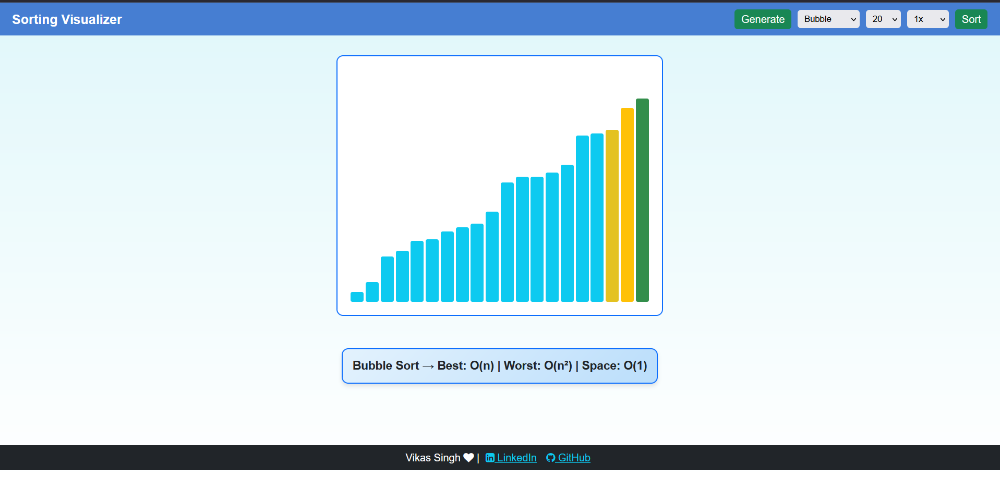
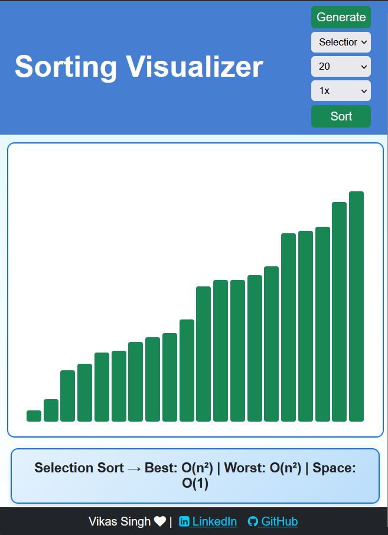

# 📊 Sorting-Algo-Visualizer-App

This is a web application built using *HTML, CSS, and JavaScript* to visualize classic sorting algorithms in action.  
It helps beginners understand how sorting works by providing an interactive and animated visualization.

---

## 🚀 Live Demo
Check out the **Sorting Algo Visualizer App** live:

🔗 [Live Demo](https://sorting-algo-visualizer-app-uci4.vercel.app/)

---

## 📂 Source Code
The full project is available on GitHub.  
Feel free to **clone, explore, and contribute**:
🔗 [GitHub Repository](git@github.com:Vikas-Singh-dev/)  

---

## 🎯 Purpose
I built this Sorting Visualizer web application to:  
- Improve my skills in *HTML, CSS, and JavaScript*.  
- Help beginners in programming gain a deeper understanding of sorting algorithms.  
- Provide a clear, visual way to learn the step-by-step process of sorting.

---

## 🔢 Algorithms Implemented

This application currently supports the following sorting algorithms, each visualized step by step:

1. 🫧 **Bubble Sort** – Repeatedly swaps adjacent elements to sort the array.  
2. 📥 **Insertion Sort** – Builds the sorted array one element at a time.  
3. 🔍 **Selection Sort** – Selects the minimum element and places it at the correct position.  
4. 🔗 **Merge Sort** – Divides the array and merges sorted subarrays efficiently.  
5. ⚡ **Quick Sort** – Uses divide-and-conquer with a pivot for fast sorting.
---

## 🛠 Tech Stack

The **Sorting Algo Visualizer App** is built using the following technologies:

- **HTML5** – Provides the structure and semantic layout of the web application.  
- **CSS3** – Handles styling, animations, and responsive design.  
- **JavaScript (ES6+)** – Implements the sorting algorithms and dynamic visualization logic.

---

## 📷 Screenshots

---

## 💡 How to Use
1. Open the live demo or run the project locally.  
2. Select a sorting algorithm from the options.  
3. Watch the bars being sorted step by step.  
4. Adjust array size and speed (if features available).  

